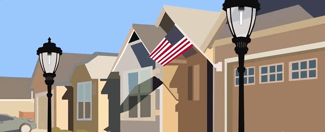
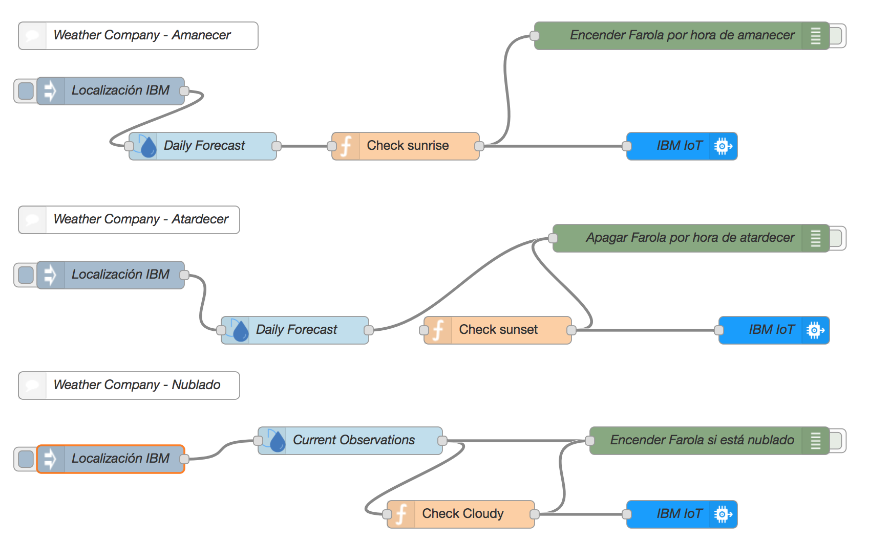
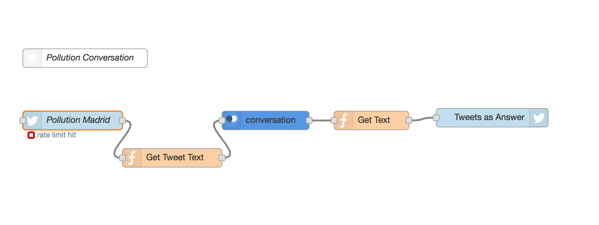
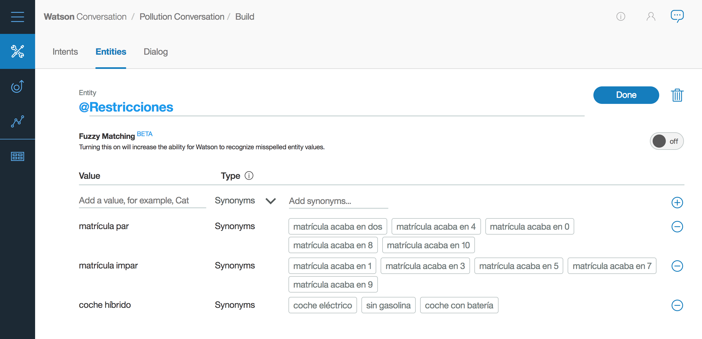
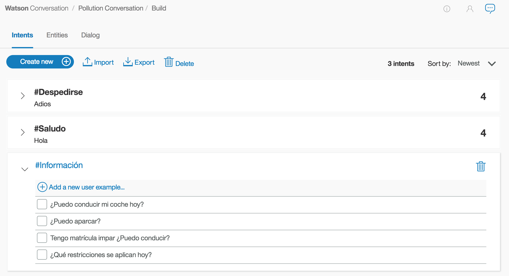

# Cost-effective Cognitive City (CeCC)

## Índice

1. [Descripción](https://github.com/nachoad/cost-effective-cognitive-city#descripción)
2. [Caso de negocio](https://github.com/nachoad/cost-effective-cognitive-city#caso-de-negocio)
3. [Prototipo](https://github.com/nachoad/cost-effective-cognitive-city#prototipo)
4. [ROI](https://github.com/nachoad/cost-effective-cognitive-city#roi)
5. [Enlaces](https://github.com/nachoad/cost-effective-cognitive-city#enlaces)
6. [Capturas](https://github.com/nachoad/cost-effective-cognitive-city#capturas)

## Descripción

*Proyecto con el que participo en el Hackaton interno de IBM.* 

El objetivo fundamental es desarrollar una aplicación de forma rápida y sencilla con los servicios de [Bluemix](https://bluemix.net) y [NodeRed](https://nodered.org/).

A la hora de realizar este proyecto, se ha pensado en ciudades, pero podríamos pensar también en parques empresariales, empresas con recintos de varios edificios, etc.

## Caso de negocio

Hoy en día podríamos pensar en sensorizar cada una de las farolas y cada uno de los parques. Esto conllevaría un gasto muy elevado.
Sin embargo con este proyecto nos aprovechamos de los millones de sensores que ya tenemos disponibles gracias a [The Weather Channel](https://weather.com) y de los que podemos obtener información como el clima, temperatura, horas del sol, niveles de CO2, etc...

### Funcionalidades

- **Agente Virtual para aviso de contaminación**: gracias al servicio de **Watson Conversation**, saber si está activado el [Protocolo de contaminación de Madrid](http://www.madrid.es/portales/munimadrid/es/Inicio/Movilidad-y-transportes/Preguntas-frecuentes-generales-sobre-el-protocolo-para-episodios-de-alta-contaminacion?vgnextfmt=default&vgnextoid=6ac1c93b6ca18510VgnVCM2000001f4a900aRCRD&vgnextchannel=220e31d3b28fe410VgnVCM1000000b205a0aRCRD) (por ejemplo) es muy sencillo. Un agente virtual nos contesta a preguntas sobre el estado. Este agente virtual integra el servicio de The Weather Channel para conocer las condiciones de NO2 y poder hacer predicciones sobre la activación del protocolo. Además gracias a NodeRed, podemos verificar [el estado](http://www.madrid.es/portales/munimadrid/es/Inicio/Movilidad-y-transportes/Hoy-27-de-octubre-activado-escenario-2-del-Protocolo-de-contaminacion-manana-28-de-octubre-de-2017-escenario-1?vgnextfmt=default&vgnextoid=c109671f30d5f510VgnVCM1000001d4a900aRCRD&vgnextchannel=220e31d3b28fe410VgnVCM1000000b205a0aRCRD) actual desde la web de La Comunidad de Madrid. Para preguntar al servicio sólo tienes que escribir un tweet con el hashtag **#pollutionmadrid**.
- **Detección de día/noche**: utilizando el servicio de The Weather Channel, el sistema obtiene la hora exacta de amanecer, atardecer y anochecer en la localización exacta. Esto permite saber cuando encender/apagar el alumbrado.
- **Detección de climatología**: utilizando el servicio de **The Weather Channel**, el sistema obtiene la temperatura y el clima exácto de la zona. Esto permite la activación de los sistemas de riego de los parques en los momentos más adecuados. Igualmente este dato también se utiliza para cuando hay poca visibilidad (por niebla o nubes) se encienda antes el alumbrado.

## Prototipo

El prototipo se ha probado con una Raspberry PI 3 y unos LEDs para poder hacer una simulación real delante de un cliente.

Esta conexión ha sido muy fácil gracias a **Watson IoT platform**. Esta plataforma nos ha permitido conectar la Raspberry a NodeRed.

## ROI

El ROI de este proyecto es inmediato si pensamos en términos **económicos**.

Por una parte encontraremos el ahorro de no alumbrar las calles de las ciudades en horas que no sea necesario o en condiciones climáticas determinadas. 

Igualmente tendremos un claro ahorro con el riego de los parques, siempre que las condiciones climáticas sean las adecuadas para ello.

Además ganamos en seguridad ciudadana (encendiendo farolas en zonas donde hay mucha niebla, o se hace de noche pronto).
 

## Enlaces

#### Consola de NodeRed
El flujo de NodeRed está desplegado en: [hackarriquitaun.mybluemix.net](https://hackarriquitaun.mybluemix.net/)
(si quieres saber la contraseña, envíame un mail. No obstante, más abajo tienes capturas de los flujos)

#### Servicio de The Weather Channel
The Weather Channel: [https://console.bluemix.net/docs/services/Weather/index.html?pos=2](https://console.bluemix.net/docs/services/Weather/index.html?pos=2)

## Capturas

La siguiente captura de pantalla muestra el flujo de NodeRed implementado para hacer el prototipo del proyecto:

La siguiente captura de pantalla muestra el flujo de NodeRed implementado para hacer el prototipo del conversation que recoge el #hashtag de Twitter y contesta a la persona si está activado el protocolo:

En la siguiente captura se muestran *Las Entidades* con las que se ha entrenado al **Watson Conversation**:

En la siguiente captura se muestran *Las Intenciones* con las que se ha entrenado al **Watson Conversation**:

